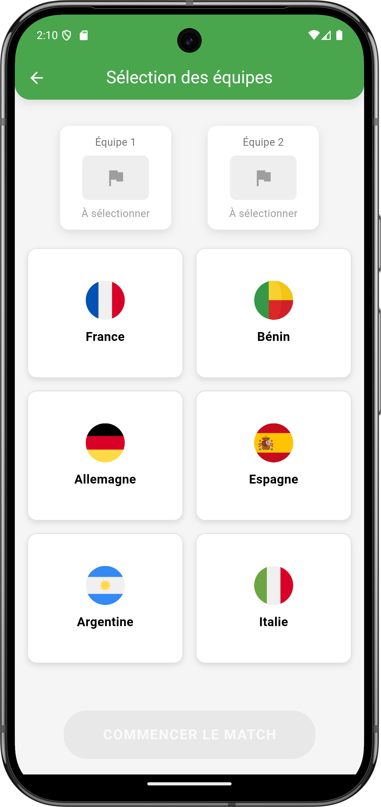
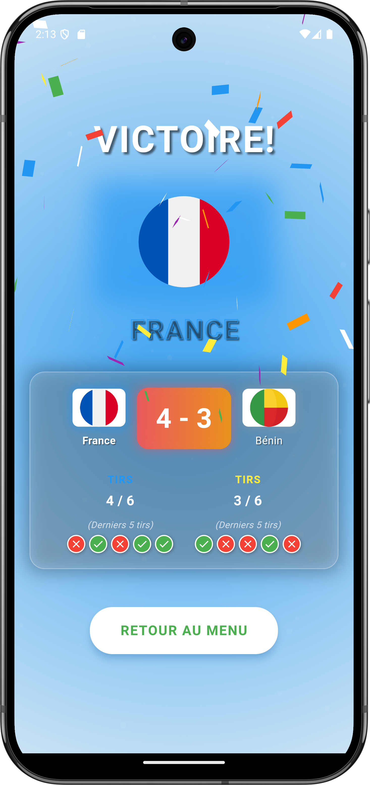

# HappyGoal - Le défi des penalties

HappyGoal est un jeu de football mobile développé avec Flutter, mettant l'accent sur les séances de tirs au but (penalties). Les joueurs s'affrontent dans des duels de penalties palpitants, avec des équipes colorées et une expérience de jeu immersive.


## 📱 Caractéristiques

- **Mode Penalty Shootout**: Affrontez-vous dans des séances de tirs au but classiques avec 5 tirs par équipe
- **Mode Mort Subite**: En cas d'égalité, le jeu bascule automatiquement en mode mort subite
- **Sélection d'Équipes**: Choisissez parmi diverses équipes avec différentes couleurs et styles
- **Animations Dynamiques**: Des mouvements fluides pour les joueurs, le gardien et le ballon
- **Effets Sonores**: Une ambiance immersive avec des sons de stade, tirs et célébrations

## 🎮 Comment jouer

1. **Sélection d'équipe**: Commencez par choisir deux équipes qui s'affronteront
2. **Tireur**: Pour chaque tir, choisissez une direction (gauche, centre, droite)
3. **Gardien**: Le gardien plongera aléatoirement dans l'une des trois directions
4. **Résultats**: Un but est marqué si le gardien plonge dans une direction différente de celle choisie

## 📝 Règles du jeu

- Chaque équipe dispose de 5 tirs lors de la phase normale
- L'équipe qui marque le plus de buts remporte le match
- En cas d'égalité après les 5 tirs, une phase de mort subite commence
- Pendant la mort subite, les équipes tirent à tour de rôle jusqu'à ce qu'une équipe prenne l'avantage

## 🛠️ Technologie

HappyGoal est développé avec Flutter, offrant une expérience utilisateur fluide et réactive sur iOS et Android.

### Principales dépendances

- Flutter SDK
- Dart
- Audioplayers (pour les effets sonores)

## 📥 Installation

1. Assurez-vous d'avoir Flutter et Dart installés sur votre machine
2. Clonez ce dépôt:
   ```
   git clone https://github.com/happyazondekon/happygoal.git
   ```
3. Naviguez vers le répertoire du projet:
   ```
   cd happygoal
   ```
4. Installez les dépendances:
   ```
   flutter pub get
   ```
5. Lancez l'application:
   ```
   flutter run
   ```

## 🏗️ Structure du projet

```
lib/
├── constants.dart
├── main.dart
├── models/
│   ├── game_state.dart
│   ├── team.dart
├── screens/
│   ├── game_screen.dart
│   ├── home_screen.dart
│   ├── result_screen.dart
│   ├── team_selection_screen.dart
├── utils/
│   ├── audio_manager.dart
│   ├── game_logic.dart
├── widgets/
│   ├── goal_post_widget.dart
│   ├── score_board_widget.dart
│   ├── shot_controller_widget.dart
```

## 📷 Captures d'écran






## ✨ Fonctionnalités à venir

- Mode multijoueur en ligne
- Statistiques de jeu et classements
- Davantage d'équipes et de stades
- Mode tournoi
- Personnalisation des joueurs

## 🤝 Contribuer

Les contributions sont les bienvenues! N'hésitez pas à ouvrir une issue ou à soumettre une pull request.

